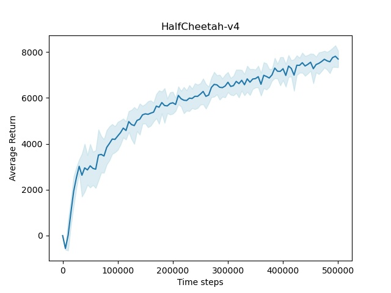

# Introduction
This is an implementation of the research paper [Addressing Function Approximation Error in Actor-Critic Methods](https://arxiv.org/pdf/1802.09477.pdf). This repo contains only the TD3 implementation, other algorithms mentioned in the paper are not **implemented**.

You can run this code by 
```bash
$ python main.py # train an agent on a single environment(use --env_name to change the environment)
$ run.sh # train agents on the environments listed in run.sh file 

```

The result of 10 trails (default) will be stored in the result directory. The agent undergoes training for 500,000 steps and is evaluated every 5,000 steps (including the initial policy). Each evaluation consists of 10 episodes, and during evaluation, the action noise is eliminated. 


# Result
The shaded area represents the standard deviation.

